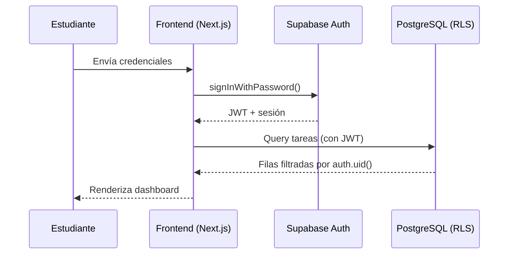
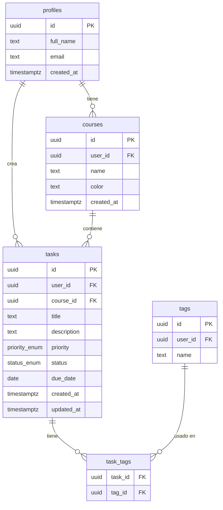
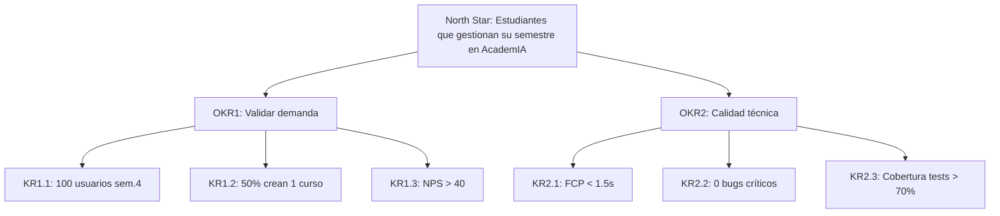

# PRD — AcademIA
### Gestor de tareas académicas para estudiantes de maestría y posgrado

---

## Tabla de versiones

| Versión | Fecha | Autor | Cambios |
|---|---|---|---|
| v1.0 | 2026-07-02 | Principal PM (AI-generated draft) | Versión inicial del PRD para MVP |

## Tabla de contenido

1. [PR/FAQ](#1-prfaq--press-release--preguntas-frecuentes)
2. [Análisis de Competencia](#2-análisis-de-competencia-matriz-de-decisión)
3. [Personas y User Journey Maps](#3-personas-y-user-journey-maps)
4. [Casos de Uso con Diagramas](#4-casos-de-uso-con-diagramas)
5. [Historias de Usuario con Gherkin](#5-historias-de-usuario-con-gherkin-real)
6. [Arquitectura Técnica y Árbol de Carpetas](#6-arquitectura-técnica-y-árbol-de-carpetas)
7. [Modelo de Datos — DDL + ER](#7-modelo-de-datos--ddl-completo--diagrama-er)
8. [Estrategia de RLS](#8-estrategia-de-rls-row-level-security)
9. [Wireframes Funcionales](#9-wireframes-funcionales-por-pantalla)
10. [Plan de Implementación (Gantt)](#10-plan-de-implementación-con-dependencias-gantt)
11. [KPI Tree y OKRs](#11-kpi-tree-y-okrs-del-mvp)
12. [Estrategia de Testing](#12-estrategia-de-testing)
13. [Variables de Entorno](#13-variables-de-entorno)
14. [Matriz de Riesgos](#14-matriz-de-riesgos)
15. [Checklist de Accesibilidad](#15-checklist-de-accesibilidad)

---

## 1. PR/FAQ — Press Release + Preguntas Frecuentes

### Press Release

AcademIA es el gestor de tareas académicas diseñado específicamente para estudiantes de maestría y posgrado que combinan estudio con trabajo, familia o investigación. A diferencia de Trello, Notion, Google Classroom o ClickUp —herramientas genéricas que exigen configuración manual y curva de aprendizaje alta— AcademIA llega preconfigurado con el vocabulario académico real (cursos, entregas, prioridad por peso en la nota, calendario de semestre) y un dashboard que responde en segundos a la pregunta que todo estudiante de posgrado se hace cada domingo: "¿qué tengo pendiente y qué es lo más urgente?". El público objetivo son estudiantes de posgrado con tiempo fragmentado (María, Carlos) y docentes que necesitan visibilidad sobre el avance de sus tesistas (Dra. Laura). AcademIA no compite por ser la herramienta más flexible del mercado; compite por ser la que un estudiante de posgrado puede adoptar en menos de 5 minutos sin tutorial.

### FAQ

| # | Pregunta | Respuesta |
|---|----------|-----------|
| 1 | ¿Cómo se protegen los datos de los estudiantes? | Supabase Auth gestiona credenciales con hashing estándar (bcrypt) y tokens JWT de corta duración. Todas las tablas usan Row Level Security (RLS), por lo que ningún usuario puede leer o modificar datos de otro, incluso si hay un bug en el frontend. No se almacenan contraseñas en texto plano ni se exponen `service_role` keys en el cliente. |
| 2 | ¿Cómo escala la arquitectura a 100k usuarios? | Supabase (PostgreSQL gestionado) escala verticalmente hasta decenas de millones de filas sin cambios de esquema; Next.js en Vercel Edge distribuye la carga de renderizado. El cuello de botella esperado a 100k usuarios activos es el plan de Supabase (conexiones concurrentes), mitigado con connection pooling (PgBouncer, incluido en Supabase) y con índices compuestos definidos desde el MVP (sección 7). |
| 3 | ¿Qué nos diferencia realmente de Notion o ClickUp? | Notion y ClickUp son lienzos en blanco: potentes pero requieren que el usuario diseñe su propio sistema. AcademIA no es un lienzo, es un sistema ya diseñado para el ciclo de vida académico (curso → tarea → prioridad → fecha de entrega), sin necesidad de plantillas ni configuración previa. |
| 4 | ¿Cómo se retiene al usuario después del primer mes? | El riesgo de abandono post-registro es el más alto del proyecto (ver Matriz de Riesgos). La mitigación central es el onboarding guiado: el usuario crea su primer curso y su primera tarea en el mismo flujo de registro, para que el valor se sienta en el primer uso, no en la sesión 5. |
| 5 | ¿Cómo se prioriza time-to-market vs calidad en un MVP de 6-8 semanas? | Se usa MoSCoW (sección 4) para congelar el scope: solo los "Must" entran al MVP. La calidad no se negocia en autenticación y RLS (seguridad), pero sí se negocia en pulido visual y features "Could", que se documentan como backlog post-MVP. |
| 6 | ¿Cuál es el costo estimado en Supabase/Vercel a escala? | En el tier gratuito de Supabase (hasta 50k usuarios activos mensuales) y Vercel Hobby, el MVP no genera costo de infraestructura. Al cruzar ese umbral, Supabase Pro (25 USD/mes base + uso) y Vercel Pro (20 USD/mes) cubren tráfico moderado; el costo crece principalmente con almacenamiento de archivos adjuntos (fuera de scope del MVP) más que con usuarios activos. |
| 7 | ¿Por qué un estudiante pagaría por esto si Google Classroom es gratis? | Google Classroom está diseñado para que el profesor administre un curso, no para que el estudiante administre su semestre completo entre varios cursos y profesores. AcademIA se posiciona como la vista consolidada que Google Classroom no ofrece, y el MVP se lanza gratuito para validar retención antes de introducir un modelo de precio (fuera de scope de este documento). |

**Decisión:** El PR/FAQ fija el posicionamiento — "el sistema ya diseñado para el ciclo de vida académico, no un lienzo en blanco" — como criterio de corte para todas las decisiones de producto posteriores en este PRD.

---

## 2. Análisis de Competencia (Matriz de Decisión)

| Dimensión | AcademIA | Trello | Notion | Google Classroom | ClickUp |
|---|---|---|---|---|---|
| Público objetivo | Estudiantes y docentes de posgrado | Equipos generalistas | Equipos y creadores de conocimiento | Aulas K-12 y pregrado | Equipos de producto/operaciones |
| Curva de aprendizaje | Baja (vocabulario académico preconfigurado) | Baja | Alta (requiere diseñar el sistema) | Baja | Alta (exceso de opciones) |
| Modo offline | No en MVP (roadmap) | Limitado | Limitado | No | Limitado |
| Gestión de prioridades | Nativa por tarea + curso, visible en dashboard | Manual vía etiquetas/listas | Manual vía propiedades | Inexistente (solo fechas) | Nativa pero genérica |
| Precio | Gratuito en MVP | Freemium (~5 USD/mes Standard) | Freemium (~10 USD/mes Plus) | Gratuito (institucional) | Freemium (~7 USD/mes Unlimited) |

### Matriz de diferenciación

AcademIA es la única herramienta de esta lista que llega con el modelo de datos académico ya resuelto (curso, tarea, prioridad, fecha de entrega) sin requerir configuración, y que ofrece en el mismo dashboard tanto la carga de trabajo del estudiante como, a futuro, la visibilidad del docente sobre sus tesistas — algo que ninguna de las cuatro herramientas comparadas resuelve de forma nativa.

### Estrategia de posicionamiento

"AcademIA es el sistema de gestión académica que un estudiante de posgrado adopta en 5 minutos, no la plantilla que tiene que construir en un fin de semana."

**Decisión:** El MVP no compite en flexibilidad (Notion/ClickUp) ni en gratuidad institucional (Classroom); compite en tiempo-a-valor. Toda decisión de UX prioriza reducir pasos de onboarding sobre añadir configurabilidad.

---

## 3. Personas y User Journey Maps

### Persona 1 — María, 28

**Perfil:** Estudiante de maestría en Inteligencia Artificial, trabaja medio tiempo como analista de datos.
**Dolores:** Pierde fechas de entrega entre el trabajo y 4 cursos simultáneos; usa notas sueltas en el celular.
**Objetivos:** Ver en un solo lugar todo lo que debe entregar esta semana, ordenado por urgencia real.
**Jobs to be done:** "Cuando tengo 10 minutos libres entre reuniones, quiero saber instantáneamente qué tarea es más urgente, para no invertir ese tiempo en decidir qué hacer."

| Fase | Acción | Pensamiento | Dolor | Oportunidad |
|---|---|---|---|---|
| Descubrimiento | Busca "gestor de tareas para estudiantes" tras perder una entrega | "Necesito algo que ya entienda cómo es mi semestre" | Herramientas genéricas requieren configurar todo desde cero | Landing que muestre el dashboard ya lleno de datos de ejemplo |
| Onboarding | Se registra y crea su primer curso | "Espero no tener que llenar 10 campos" | Formularios largos previos al primer valor percibido | Onboarding de un solo paso: curso + primera tarea |
| Uso diario | Revisa el dashboard entre reuniones | "¿Qué es lo más urgente ahora mismo?" | Prioridad no siempre es visible sin abrir cada tarea | Badge de prioridad visible en la vista de lista |
| Retención | Vuelve la semana siguiente | "¿Sigue actualizado o tengo que revisar todo de nuevo?" | Si no confía en los datos, abandona | Recordatorios automáticos de tareas próximas a vencer |

### Persona 2 — Carlos, 32

**Perfil:** Estudiante de MBA, padre de 3 hijos, trabaja tiempo completo.
**Dolores:** Su tiempo está fragmentado en bloques de 30-45 minutos; no puede permitirse ambigüedad sobre qué hacer.
**Objetivos:** Productividad quirúrgica — cada bloque de tiempo debe mapear a una tarea concreta.
**Jobs to be done:** "Cuando abro la app, quiero decidir en menos de 10 segundos qué tarea ataco en este bloque de tiempo, para no desperdiciar minutos valiosos decidiendo."

| Fase | Acción | Pensamiento | Dolor | Oportunidad |
|---|---|---|---|---|
| Descubrimiento | Un compañero de cohorte le recomienda AcademIA | "Si me ahorra tiempo desde el día uno, lo pruebo" | Desconfianza ante otra app más que aprender | Onboarding sin fricción y valor inmediato |
| Onboarding | Importa mentalmente sus cursos del MBA | "¿Puedo tener todo listo en un bloque de 15 minutos?" | Configuración lenta rompe su sistema de bloques | Creación rápida de curso + tarea desde un mismo formulario |
| Uso diario | Filtra tareas por curso y prioridad antes de cada bloque | "Necesito ver solo lo urgente, sin ruido" | Listas largas sin filtros combinables | Filtros combinables (curso + prioridad + búsqueda) en la vista de tareas |
| Retención | Compara semana a semana su cumplimiento | "¿Estoy mejorando o repitiendo el mismo patrón?" | Sin métricas, no hay refuerzo positivo | Métricas simples en el dashboard (tareas completadas/semana) |

### Persona 3 — Dra. Laura, 45

**Perfil:** Profesora que dirige tesis de maestría, busca dar seguimiento sin sumar otra herramienta pesada.
**Dolores:** No tiene visibilidad del avance real de sus tesistas hasta la reunión semanal.
**Objetivos:** Retroalimentación oportuna sin convertirse en administradora de otra plataforma.
**Jobs to be done:** "Cuando reviso antes de mi reunión de asesoría, quiero ver qué avanzó cada tesista, para dar retroalimentación específica en vez de genérica."

| Fase | Acción | Pensamiento | Dolor | Oportunidad |
|---|---|---|---|---|
| Descubrimiento | Sus tesistas ya usan AcademIA y le comparten avance | "No quiero instalar nada nuevo yo misma" | Rechazo a herramientas adicionales para el docente | Vista de solo lectura sin fricción de configuración (roadmap post-MVP) |
| Onboarding | Se registra solo para revisar, no para gestionar tareas propias | "Espero que esto sea rápido" | Onboarding pensado solo para estudiantes | Fuera de scope del MVP; documentado como riesgo/backlog |
| Uso diario | Revisa avance antes de reuniones de asesoría | "¿Qué se movió desde la última vez?" | Sin este dato, la reunión pierde tiempo en actualización de estado | Reportado explícitamente como funcionalidad post-MVP (sección 4, "Won't") |
| Retención | Recomienda la herramienta a otros docentes | "Si me ahorra tiempo, la sigo usando" | — | Métrica de referidos docentes en roadmap futuro |

**Decisión:** El MVP se diseña y prioriza para María y Carlos (estudiantes). La Dra. Laura queda fuera del scope técnico del MVP y se documenta como "Won't" en la sección de casos de uso — su necesidad valida un roadmap de vistas colaborativas, no una feature del MVP.

---

## 4. Casos de Uso con Diagramas

### Priorización MoSCoW

| Caso de uso | Prioridad |
|---|---|
| Registro e inicio de sesión | Must |
| Gestionar cursos (crear/editar/eliminar) | Must |
| Gestionar tareas (crear/editar/eliminar/completar) | Must |
| Ver dashboard con métricas y próximas tareas | Must |
| Filtrar y buscar tareas | Must |
| Recordatorios por email de tareas próximas a vencer | Should |
| Etiquetas (tags) personalizadas en tareas | Should |
| Modo oscuro | Should |
| Adjuntar archivos a tareas | Could |
| Calendario visual (vista mes) | Could |
| Vista de solo lectura para docentes/tesistas | Won't (MVP) |
| Modo offline / sincronización | Won't (MVP) |
| App móvil nativa | Won't (MVP) |

### Diagramas de caso de uso (Must)

```mermaid
usecaseDiagram
    actor Estudiante
    actor Sistema
    Estudiante -> (Registrarse / Iniciar sesión)
    Estudiante -> (Gestionar cursos)
    Estudiante -> (Gestionar tareas)
    Estudiante -> (Ver tablero / dashboard)
    Estudiante -> (Filtrar y buscar tareas)
    Sistema -> (Aplicar RLS por usuario)
```



**Decisión:** Los 5 "Must" definen el 100% del scope funcional del MVP; "Should" y "Could" se documentan pero no bloquean el lanzamiento. "Won't" se comunica explícitamente a stakeholders para evitar expectativas fuera de scope.

---

## 5. Historias de Usuario con Gherkin Real

### Historia 1 — Autenticación

```gherkin
COMO estudiante nuevo
QUIERO registrarme con correo y contraseña
PARA acceder a mi propio espacio de trabajo académico

Escenario: Registro exitoso
  Dado que no tengo una cuenta en AcademIA
  Cuando me registro con correo "maria@ejemplo.com" y contraseña válida
  Entonces se crea mi perfil en la tabla profiles
  Y soy redirigido al onboarding de primer curso

Escenario: Registro con correo ya existente
  Dado que ya existe una cuenta con "maria@ejemplo.com"
  Cuando intento registrarme con ese mismo correo
  Entonces veo el error "Este correo ya está registrado"
  Y no se crea un perfil duplicado
```

### Historia 2 — Gestión de cursos

```gherkin
COMO estudiante de maestría
QUIERO crear y organizar mis cursos del semestre
PARA asociar tareas a cada curso y ver mi carga por materia

Escenario: Crear curso exitosamente
  Dado que estoy autenticado
  Cuando creo un curso con nombre "Machine Learning" y color "azul"
  Entonces el curso aparece en mi lista de cursos
  Y puedo asociarle tareas inmediatamente

Escenario: Eliminar curso con tareas asociadas
  Dado que tengo el curso "Machine Learning" con 3 tareas asociadas
  Cuando elimino el curso
  Entonces veo una advertencia "Esto eliminará también sus tareas asociadas"
  Y solo se elimina si confirmo la acción
```

### Historia 3 — Gestión de tareas

```gherkin
COMO estudiante de maestría
QUIERO crear y organizar tareas con prioridad y fecha
PARA no olvidar entregas y planificar mi semana

Escenario: Crear tarea exitosamente
  Dado que estoy autenticado en la aplicación
  Cuando creo una tarea con título "Entrega parcial 2",
        prioridad "Alta", fecha "2026-07-15", curso "IA"
  Entonces la tarea aparece en mi lista de tareas
  Y recibo un toast de confirmación

Escenario: Crear tarea sin título
  Dado que estoy autenticado
  Cuando intento crear una tarea sin título
  Entonces veo un error de validación "El título es obligatorio"
  Y la tarea no se crea
```

### Historia 4 — Dashboard

```gherkin
COMO estudiante con múltiples cursos
QUIERO ver un resumen de mi carga académica
PARA decidir en segundos qué hacer primero

Escenario: Dashboard con tareas próximas
  Dado que tengo 5 tareas pendientes, 2 de ellas vencen esta semana
  Cuando abro el dashboard
  Entonces veo un contador de tareas pendientes, en progreso y vencidas
  Y veo una lista de las 5 tareas más próximas a vencer ordenadas por fecha

Escenario: Dashboard sin tareas (estado vacío)
  Dado que no tengo ninguna tarea creada
  Cuando abro el dashboard
  Entonces veo un estado vacío con un botón "Crear mi primera tarea"
  Y no veo métricas en cero sin contexto
```

### Historia 5 — Filtros y búsqueda

```gherkin
COMO estudiante con muchos cursos activos
QUIERO filtrar tareas por curso, prioridad y texto
PARA encontrar rápido lo que necesito en un bloque de tiempo corto

Escenario: Filtrar por curso y prioridad combinados
  Dado que tengo tareas en 3 cursos distintos con prioridades mixtas
  Cuando filtro por curso "MBA Finanzas" y prioridad "Alta"
  Entonces solo veo las tareas que cumplen ambos filtros

Escenario: Búsqueda sin resultados
  Dado que estoy en la vista de tareas
  Cuando busco el texto "xyz123" que no coincide con ninguna tarea
  Entonces veo un estado vacío "No se encontraron tareas"
  Y se muestra un botón para limpiar los filtros
```

**Decisión:** Cada historia Must tiene mínimo 2 escenarios automatizables (feliz + borde), lo que las hace ejecutables directamente como tests E2E en Playwright (sección 12).

---

## 6. Arquitectura Técnica y Árbol de Carpetas

```
academia/
├── app/
│   ├── (auth)/
│   │   ├── login/page.tsx        # Login (Server Component)
│   │   └── register/page.tsx
│   ├── (dashboard)/
│   │   ├── layout.tsx            # Sidebar + TopBar
│   │   ├── dashboard/page.tsx    # Métricas + gráfico
│   │   ├── courses/page.tsx
│   │   └── tasks/page.tsx
│   ├── api/                      # Solo si necesario (preferir Server Actions)
│   ├── layout.tsx                # Root layout con providers
│   └── page.tsx                  # Redirect a dashboard
├── components/
│   ├── ui/                       # shadcn/ui
│   ├── forms/                    # Formularios reutilizables
│   ├── layout/                   # Sidebar, TopBar, etc.
│   └── shared/                   # EmptyState, ErrorBoundary, etc.
├── lib/
│   ├── supabase/                 # Client, Server, Middleware clients
│   ├── utils.ts                  # cn() y helpers
│   └── validations/              # Esquemas zod
├── types/
│   └── index.ts                  # Interfaces compartidas
└── middleware.ts                 # Protección de rutas
```

### Server Components vs Client Components

| Elemento | Tipo | Justificación |
|---|---|---|
| `dashboard/page.tsx` | Server Component | Query inicial a Supabase con SSR; reduce JS enviado al cliente |
| `tasks/page.tsx` (lista) | Server Component | Carga inicial de tareas vía Server Component; filtros interactivos delegados a un Client Component hijo |
| Filtros de tareas (curso/prioridad/búsqueda) | Client Component | Requiere estado local reactivo (`useState`) y respuesta inmediata a input |
| Formularios (crear/editar tarea, curso) | Client Component | Requiere manejo de eventos (`onChange`, `onSubmit`) y validación en tiempo real con zod |
| `login/page.tsx`, `register/page.tsx` | Client Component | Interacción directa con Supabase Auth client-side y manejo de estados de error |
| Sidebar / TopBar | Server Component (estático) con slot Client para menú de usuario | El layout no cambia por interacción; solo el dropdown de usuario necesita estado |
| Modal/drawer de detalle de tarea | Client Component | Requiere apertura/cierre controlado y formulario editable |

**Decisión:** Toda pantalla inicia como Server Component por defecto; solo se convierte a Client Component la porción mínima que requiere interactividad (patrón "islands"), para mantener el bundle de JS bajo y cumplir el KR de FCP < 1.5s (sección 11).

---

## 7. Modelo de Datos — DDL Completo + Diagrama ER

### Diagrama Entidad-Relación



### DDL con PostgreSQL

```sql
-- Extensión necesaria para UUID
CREATE EXTENSION IF NOT EXISTS pgcrypto;

-- Enums
CREATE TYPE priority_enum AS ENUM ('low', 'medium', 'high');
CREATE TYPE status_enum AS ENUM ('pending', 'in_progress', 'completed');

-- Perfiles (extiende auth.users de Supabase)
CREATE TABLE profiles (
  id UUID PRIMARY KEY REFERENCES auth.users(id) ON DELETE CASCADE,
  full_name VARCHAR(120),               -- Nombre visible del usuario
  email VARCHAR(255) NOT NULL,          -- Copia del email para queries sin join a auth.users
  created_at TIMESTAMPTZ NOT NULL DEFAULT NOW(),
  updated_at TIMESTAMPTZ NOT NULL DEFAULT NOW()
);

-- Cursos del semestre
CREATE TABLE courses (
  id UUID PRIMARY KEY DEFAULT gen_random_uuid(),
  user_id UUID NOT NULL REFERENCES profiles(id) ON DELETE CASCADE, -- Dueño del curso
  name VARCHAR(120) NOT NULL,           -- Nombre del curso, ej. "Machine Learning"
  color VARCHAR(20) NOT NULL DEFAULT 'blue', -- Color para identificar visualmente el curso
  created_at TIMESTAMPTZ NOT NULL DEFAULT NOW(),
  updated_at TIMESTAMPTZ NOT NULL DEFAULT NOW()
);

CREATE INDEX idx_courses_user ON courses(user_id);

-- Tareas
CREATE TABLE tasks (
  id UUID PRIMARY KEY DEFAULT gen_random_uuid(),
  user_id UUID NOT NULL REFERENCES profiles(id) ON DELETE CASCADE,   -- Dueño de la tarea
  course_id UUID NOT NULL REFERENCES courses(id) ON DELETE CASCADE,  -- Curso asociado
  title VARCHAR(200) NOT NULL,          -- Título obligatorio de la tarea
  description TEXT,                     -- Descripción opcional
  priority priority_enum NOT NULL DEFAULT 'medium', -- Prioridad para ordenar en dashboard
  status status_enum NOT NULL DEFAULT 'pending',    -- Estado del flujo de trabajo
  due_date DATE,                         -- Fecha de entrega
  created_at TIMESTAMPTZ NOT NULL DEFAULT NOW(),
  updated_at TIMESTAMPTZ NOT NULL DEFAULT NOW()
);

CREATE INDEX idx_tasks_user_due ON tasks(user_id, due_date); -- Consulta frecuente: mis tareas por fecha
CREATE INDEX idx_tasks_user_status ON tasks(user_id, status); -- Consulta frecuente: mis tareas por estado
CREATE INDEX idx_tasks_course ON tasks(course_id);

-- Etiquetas (Should, incluido en esquema para no romper migraciones futuras)
CREATE TABLE tags (
  id UUID PRIMARY KEY DEFAULT gen_random_uuid(),
  user_id UUID NOT NULL REFERENCES profiles(id) ON DELETE CASCADE,
  name VARCHAR(50) NOT NULL,             -- Nombre de la etiqueta
  created_at TIMESTAMPTZ NOT NULL DEFAULT NOW()
);

CREATE TABLE task_tags (
  task_id UUID NOT NULL REFERENCES tasks(id) ON DELETE CASCADE,
  tag_id UUID NOT NULL REFERENCES tags(id) ON DELETE CASCADE,
  PRIMARY KEY (task_id, tag_id)
);

-- Trigger genérico para updated_at
CREATE OR REPLACE FUNCTION set_updated_at()
RETURNS TRIGGER AS $$
BEGIN
  NEW.updated_at = NOW();
  RETURN NEW;
END;
$$ LANGUAGE plpgsql;

CREATE TRIGGER trg_profiles_updated_at
  BEFORE UPDATE ON profiles
  FOR EACH ROW EXECUTE FUNCTION set_updated_at();

CREATE TRIGGER trg_courses_updated_at
  BEFORE UPDATE ON courses
  FOR EACH ROW EXECUTE FUNCTION set_updated_at();

CREATE TRIGGER trg_tasks_updated_at
  BEFORE UPDATE ON tasks
  FOR EACH ROW EXECUTE FUNCTION set_updated_at();
```

**Decisión:** Se usa `gen_random_uuid()` (uuid v4, vía `pgcrypto`) en lugar de UUID v7 porque Supabase no expone una función nativa de UUID v7 sin extensión adicional; el MVP prioriza compatibilidad out-of-the-box sobre ordenabilidad de PK, mitigado con los índices explícitos sobre `due_date` y `status`.

---

## 8. Estrategia de RLS (Row Level Security)

### Helper functions reutilizables

```sql
CREATE OR REPLACE FUNCTION is_owner(table_user_id UUID)
RETURNS BOOLEAN AS $$
  SELECT auth.uid() = table_user_id;
$$ LANGUAGE SQL STABLE;
```

### Políticas por tabla

```sql
-- profiles
ALTER TABLE profiles ENABLE ROW LEVEL SECURITY;

CREATE POLICY "Users can view own profile"
  ON profiles FOR SELECT
  USING (is_owner(id));

CREATE POLICY "Users can update own profile"
  ON profiles FOR UPDATE
  USING (is_owner(id));

-- courses
ALTER TABLE courses ENABLE ROW LEVEL SECURITY;

CREATE POLICY "Users can view own courses"
  ON courses FOR SELECT
  USING (is_owner(user_id));

CREATE POLICY "Users can insert own courses"
  ON courses FOR INSERT
  WITH CHECK (is_owner(user_id));

CREATE POLICY "Users can update own courses"
  ON courses FOR UPDATE
  USING (is_owner(user_id));

CREATE POLICY "Users can delete own courses"
  ON courses FOR DELETE
  USING (is_owner(user_id));

-- tasks
ALTER TABLE tasks ENABLE ROW LEVEL SECURITY;

CREATE POLICY "Users can view own tasks"
  ON tasks FOR SELECT
  USING (is_owner(user_id));

CREATE POLICY "Users can insert own tasks"
  ON tasks FOR INSERT
  WITH CHECK (is_owner(user_id));

CREATE POLICY "Users can update own tasks"
  ON tasks FOR UPDATE
  USING (is_owner(user_id));

CREATE POLICY "Users can delete own tasks"
  ON tasks FOR DELETE
  USING (is_owner(user_id));

-- tags y task_tags siguen el mismo patrón (omitido por brevedad, idéntico a courses)
```

**Decisión:** Ninguna tabla queda sin RLS habilitado, incluso las de baja sensibilidad (`tags`). Esto se define como regla no negociable del proyecto (ver Estrategia de Testing, sección 12: 100% de cobertura manual en RLS/auth).

---

## 9. Wireframes Funcionales por Pantalla

### 1. Login

```
┌───────────────────────────────────────────────────┐
│ ┌─Panel Izquierdo───────┐ ┌─Panel Derecho────────┐ │
│ │  (gradiente azul/     │ │                       │ │
│ │   morado)              │ │   Bienvenido de vuelta│ │
│ │                        │ │   ┌─────────────────┐ │ │
│ │  "Tu semestre,         │ │   │ Email           │ │ │
│ │   organizado en        │ │   └─────────────────┘ │ │
│ │   un solo lugar."      │ │   ┌─────────────────┐ │ │
│ │                        │ │   │ Contraseña      │ │ │
│ │                        │ │   └─────────────────┘ │ │
│ │                        │ │   [ Iniciar sesión ]  │ │
│ │                        │ │   ¿No tienes cuenta?  │ │
│ └────────────────────────┘ └───────────────────────┘ │
└───────────────────────────────────────────────────┘
```

### 2. Dashboard

```
┌──────────────────────────────────────────────┐
│  ┌─Sidebar──┐ ┌─TopBar───────────────────┐  │
│  │ 📊 Dash  │ │ 🔍 Buscar...    👤 User ▼│  │
│  │ 📁 Cursos│ └──────────────────────────┘  │
│  │ ✅ Tareas│ ┌─Main Content────────────┐  │
│  │ ──────── │ │ 📊 Panel de Control     │  │
│  │ ⚙️ Config│ │ ┌────┬────┬────┐       │  │
│  └──────────┘ │ │Pend│Prog│Venc│       │  │
│               │ │ 12 │ 4  │ 3  │       │  │
│               │ └────┴────┴────┘       │  │
│               │ ┌─Gráfico semanal─────┐ │  │
│               │ │  ▂▄▆█▅▃▂            │ │  │
│               │ └─────────────────────┘ │  │
│               │ ┌─Próximas tareas─────┐ │  │
│               │ │ • Entrega parcial 2 │ │  │
│               │ │ • Ensayo Finanzas   │ │  │
│               │ └─────────────────────┘ │  │
│               └────────────────────────┘  │
└──────────────────────────────────────────────┘
```

### 3. Lista de Tareas

```
┌──────────────────────────────────────────────┐
│  ┌─Sidebar──┐ ┌─TopBar───────────────────┐  │
│  │  ...     │ │ 🔍 Buscar...    👤 User ▼│  │
│  └──────────┘ └──────────────────────────┘  │
│               ┌─Filtros──────────────────┐  │
│               │ [Curso ▾] [Prioridad ▾] 🔍│ │
│               └──────────────────────────┘  │
│               ┌─Tabla────────────────────┐  │
│               │ Título      Curso  Prior.│  │
│               │ Entrega P2  IA     Alta  │  │
│               │ Ensayo      MBA    Media │  │
│               │ Lectura Cap4 IA    Baja  │  │
│               └──────────────────────────┘  │
└──────────────────────────────────────────────┘
```

### 4. Detalle de Tarea (drawer)

```
┌──────────────────────────────────┐
│ ✕  Editar tarea                  │
│ ┌───────────────────────────────┐│
│ │ Título: Entrega parcial 2     ││
│ │ Curso:  [IA ▾]                ││
│ │ Prioridad: [Alta ▾]           ││
│ │ Fecha:  [2026-07-15]          ││
│ │ Descripción:                  ││
│ │ ┌───────────────────────────┐ ││
│ │ │                           │ ││
│ │ └───────────────────────────┘ ││
│ │ Estado: [Pendiente ▾]         ││
│ └───────────────────────────────┘│
│  [Cancelar]   [Guardar cambios]  │
└──────────────────────────────────┘
```

### Componentes shadcn/ui por pantalla

| Pantalla | Componentes shadcn/ui |
|---|---|
| Login | `Card`, `Input`, `Button`, `Label` |
| Dashboard | `Card`, `Badge`, `Separator`, `ScrollArea`, componente de gráfico (recharts vía shadcn `chart`) |
| Lista de Tareas | `Table`, `Select`, `Input` (búsqueda), `Badge` (prioridad/estado), `DropdownMenu` |
| Detalle de Tarea | `Sheet` (drawer), `Input`, `Textarea`, `Select`, `Button`, `Calendar`/`Popover` (fecha) |

**Decisión:** El drawer (`Sheet`) se prefiere sobre un modal centrado (`Dialog`) para el detalle de tarea, porque permite mantener visible la lista de tareas detrás, reduciendo la sensación de "salto de contexto" reportada como dolor en los journey maps de María y Carlos.

---

## 10. Plan de Implementación con Dependencias (Gantt)

| Fase | Tareas | Días | Depende de | Riesgo |
|------|--------|------|------------|--------|
| 1. Fundación | Auth + Layout + Middleware | 1-4 | — | Bajo |
| 2. Cursos | CRUD cursos + RLS | 5-8 | Fase 1 | Bajo |
| 3. Tareas | CRUD tareas + filtros | 9-15 | Fase 2 | Medio |
| 4. Dashboard | Métricas + gráfico | 16-20 | Fase 3 | Medio |
| 5. Pulido | Tests + Responsive + Deploy | 21-28 | Fase 4 | Alto |

### Criterios de salida (Definition of Done) por fase

- **Fase 1:** Un usuario puede registrarse, iniciar sesión y cerrar sesión; rutas protegidas redirigen a `/login` si no hay sesión; RLS habilitado en `profiles`.
- **Fase 2:** CRUD completo de cursos con RLS verificado (usuario A no puede ver/editar cursos de usuario B, probado manualmente); estado vacío implementado.
- **Fase 3:** CRUD completo de tareas; filtros combinables funcionando; los 2 escenarios Gherkin por historia (sección 5) pasan en Playwright.
- **Fase 4:** Dashboard muestra contadores reales desde Supabase (no mock data); FCP medido < 1.5s en entorno de staging.
- **Fase 5:** Cobertura de tests según sección 12 alcanzada; sitio responsive verificado en 375px/768px/1440px; deploy en Vercel con variables de entorno de producción configuradas.

**Decisión:** La Fase 5 concentra el mayor riesgo (Alto) porque comprime testing + responsive + deploy en 8 días; si el cronograma se atrasa, se recorta primero el pulido visual, nunca la cobertura de tests de auth/RLS (regla no negociable, sección 8).

---

## 11. KPI Tree y OKRs del MVP

**OKR 1: Validar demanda**
- KR1.1: 100 usuarios registrados en semana 4 post-lanzamiento
- KR1.2: 50% de los usuarios registrados crean al menos 1 curso
- KR1.3: NPS > 40 en encuesta post-MVP

**OKR 2: Calidad técnica**
- KR2.1: Tiempo de carga < 1.5s (First Contentful Paint)
- KR2.2: 0 bugs críticos en producción durante las primeras 4 semanas
- KR2.3: Cobertura de tests > 70% (ver desglose por tipo en sección 12)



**Decisión:** KR1.2 (activación: crear al menos 1 curso) se prioriza como métrica líder sobre KR1.1 (registro bruto), porque el registro sin activación no valida el problema real — el onboarding guiado (sección 3) se diseñó explícitamente para mover esta métrica.

---

## 12. Estrategia de Testing

| Tipo | Herramienta | Qué probar | Cobertura mínima |
|------|------------|------------|-----------------|
| Unit | Vitest | Hooks, utils, validaciones zod | 90% |
| Component | Testing Library | Formularios, modales, estados vacío | 80% |
| E2E | Playwright | Login → Crear tarea → Ver dashboard | Flujo crítico |
| Security | Manual | RLS, inyección, auth bypass | 100% en auth |

**Decisión:** El flujo E2E crítico (Login → Crear tarea → Ver dashboard) se automatiza primero que cualquier otro test, porque es el camino exacto que recorre el onboarding de María y Carlos; si este flujo se rompe, el MVP no cumple su propuesta de valor central.

---

## 13. Variables de Entorno

| Variable | Descripción | Fuente | Requerida |
|----------|-------------|--------|-----------|
| NEXT_PUBLIC_SUPABASE_URL | URL del proyecto Supabase | Supabase dashboard | Sí |
| NEXT_PUBLIC_SUPABASE_ANON_KEY | Anon key pública | Supabase dashboard | Sí |
| SUPABASE_SERVICE_ROLE_KEY | Service role (solo server, nunca expuesta al cliente) | Supabase dashboard | Sí |

**Decisión:** `SUPABASE_SERVICE_ROLE_KEY` solo se usa en Server Actions/Route Handlers, nunca en componentes marcados `"use client"`; se añade una regla de lint (`no-restricted-imports`) para prevenir su importación accidental en código cliente.

---

## 14. Matriz de Riesgos

| Riesgo | Probabilidad | Impacto | Mitigación |
|--------|-------------|---------|------------|
| Baja retención post-registro | Alta | Alto | Onboarding guiado con primera tarea sugerida (sección 3) |
| Supabase rate limiting en Auth | Media | Medio | Implementar retry con backoff exponencial en el cliente |
| Curva de aprendizaje de shadcn/ui | Media | Bajo | Usar templates y componentes pre-hechos, evitar composición custom en el MVP |
| Deadline del semestre vs desarrollo | Alta | Alto | Priorizar features Must sobre Should/Could (MoSCoW, sección 4) |

**Decisión:** Los dos riesgos de probabilidad e impacto "Alto" (retención y deadline) comparten la misma mitigación raíz — reducir scope y fricción — por lo que cualquier presión de cronograma se resuelve recortando alcance, no recortando el onboarding guiado.

---

## 15. Checklist de Accesibilidad

- [ ] Todos los formularios tienen labels asociados (`htmlFor`)
- [ ] Contraste de color WCAG AA mínimo (4.5:1 texto normal)
- [ ] Navegación por teclado en modales, dropdowns, selects
- [ ] Roles ARIA en componentes interactivos
- [ ] Modo oscuro sin pérdida de contraste

**Decisión:** Este checklist se revisa como parte del Definition of Done de la Fase 5 (Pulido), no como una tarea aislada — cada componente de `components/ui/` debe cumplirlo antes de considerarse "hecho".

---

*Fin del documento. PRD-AcademIA-v1.0.md — legible en aproximadamente 15 minutos.*
